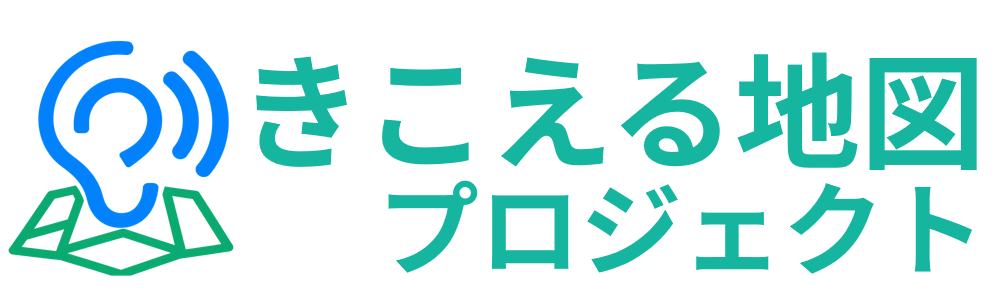
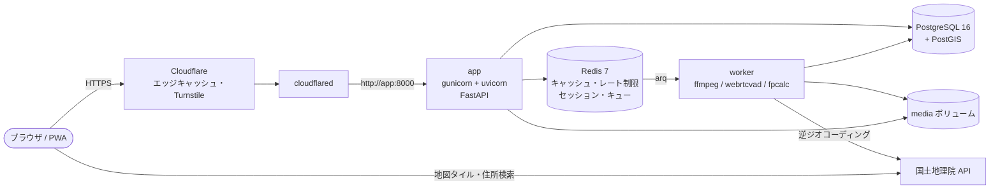

<div align="center">

<a href="https://www.kikoeru.org"></a>

# きこえる地図

**音だけで、場所を旅する。**

日本各地の「環境音」を地図に置いて共有する、オープンソースの Web サービスです。

[](https://www.kikoeru.org)
[](LICENSE)
[](https://github.com/CreamDevelopers/kikoeru-map/stargazers)
[](https://github.com/CreamDevelopers/kikoeru-map/issues)
[](https://github.com/CreamDevelopers/kikoeru-map/pulls)
[](https://github.com/CreamDevelopers/kikoeru-map/commits)
[](https://github.com/CreamDevelopers/kikoeru-map)

[](https://www.python.org/)
[](https://fastapi.tiangolo.com/)
[](https://www.sqlalchemy.org/)
[](https://www.postgresql.org/)
[](https://postgis.net/)
[](https://redis.io/)
[](https://ffmpeg.org/)
[](https://leafletjs.com/)
[](https://docs.docker.com/compose/)
[](https://www.cloudflare.com/products/tunnel/)
[](https://docs.astral.sh/ruff/)
[](https://mypy-lang.org/)
[](https://web.dev/explore/progressive-web-apps)

[公式サイト](https://www.kikoeru.org) ・ [きこえる地図をひらく](https://map.kikoeru.org/) ・ [不具合の報告](https://github.com/CreamDevelopers/kikoeru-map/issues) ・ [開発に参加](#開発に参加する)

</div>

---

## 目次

- [きこえる地図とは](#きこえる地図とは)
- [主な機能](#主な機能)
- [技術スタック](#技術スタック)
- [構成](#構成)
- [クイックスタート](#クイックスタート)
- [本番公開（Cloudflare）](#本番公開cloudflare)
- [運用](#運用)
- [ディレクトリ構成](#ディレクトリ構成)
- [設計判断](#設計判断)
- [開発に参加する](#開発に参加する)
- [スポンサー](#スポンサー)
- [ライセンス](#ライセンス)
- [クレジット](#クレジット)

## きこえる地図とは


駅のアナウンス、商店街のざわめき、川のせせらぎ、夏祭りのお囃子。場所には、その場所だけの音があります。

きこえる地図は、そうした音を誰でも地図の上に置いて共有できる Web サービスです。地図のピンをタップするとその場所の音が流れ、写真ではなく音だけで各地を旅できます。アカウントは不要で、スマートフォンのブラウザから録音してそのまま投稿できます。

地図には国土地理院の地理院タイルを使っているため、対象は日本国内です。

<table>
  <tr>
    <td align="center"><br><sub>淡色地図（初期表示）</sub></td>
    <td align="center"><br><sub>標準地図</sub></td>
    <td align="center"><br><sub>写真</sub></td>
  </tr>
</table>
<sub>地図の出典: <a href="https://maps.gsi.go.jp/development/ichiran.html">国土地理院</a>（地理院タイル）</sub>

## 主な機能

| | 機能 | 概要 |
| :-: | --- | --- |
|  | **聴く** | ピンをタップして、波形付きプレイヤーで再生。シーク、フェードイン・アウト、ロック画面からの操作、キーボード操作 |
|  | **時間違い比較** | 半径 50m 以内の音を並べて聴き比べ。2 音を同時に再生し、スライダーで割合を変更 |
|  | **散歩モード** | ランダムな音をクロスフェードでつなぎ、地図が flyTo で移動。地方・天気・時間帯・季節・ジャンルで絞り込み、没入表示、スリープタイマー |
|  | **散歩コース** | 管理者が作る特集。ルートを描いて順番に再生 |
|  | **音の風景** | 地図の中心を立ち位置として、周囲の最大 8 音を PannerNode（HRTF）で立体的に定位 |
|  | **みみあて** | 音だけで場所を当てる 5 問のゲーム（サーバー採点・1 問最大 5000 点）。今日のお題とランキング |
|  | **投稿** | ブラウザ録音（レベルメーター・リアルタイム波形・残り時間）またはファイル選択 → トリミング → 場所 → 詳細 → ライセンス・同意・Turnstile → 送信。進行状況を SSE で表示 |
|  | **自動処理** | 形式判定、ラウドネス正規化、メタデータ削除、WebM / M4A 生成、波形・スペクトログラム・OGP 画像、無音・人の声・音割れ・重複のチェック |
|  | **PWA** | ホーム画面に追加。一度聴いた音と地図タイルはオフラインでも利用可能 |
|  | **管理画面** | ダッシュボード、投稿管理、確認待ちキュー（A / R キー）、通報、BAN、NG ワード、コース、設定、ジョブ監視、監査ログ、アカウント、TOTP |

## 技術スタック

<p align="center">
  <a href="https://skillicons.dev"></a>
</p>

| 分類 | 使用技術 |
| --- | --- |
| バックエンド | Python 3.12 / FastAPI / SQLAlchemy 2.x（async, asyncpg）/ Alembic / Pydantic v2 |
| アプリサーバー | gunicorn + uvicorn worker |
| データベース | PostgreSQL 16 + PostGIS（`geography(Point, 4326)` + GiST） |
| キャッシュ・キュー | Redis 7 / arq |
| 音声処理 | ffmpeg / ffprobe / webrtcvad / numpy / Chromaprint（fpcalc） |
| フロントエンド | Jinja2 + Vanilla JS（ES モジュール、ビルド工程なし）/ Web Audio API |
| 地図 | Leaflet 1.9.4 / Supercluster / Leaflet.heat / 国土地理院タイル・住所検索・逆ジオコーダー |
| 公開・セキュリティ | Docker Compose / Cloudflare Tunnel / Cloudflare Turnstile |
| 品質 | pytest / httpx / pytest-asyncio / ruff / mypy |

## 構成



- `app` と `worker` は同じイメージ（`kikoeru-app`）で、起動コマンドだけが違います（`web` / `worker`）。
- `app` のポートはホストに公開しません。外部公開は `cloudflared` 経由だけです。
- `app` の起動時に `alembic upgrade head` を実行します（advisory lock で二重実行を防止）。`worker` と `cloudflared` は、`app` が healthy になってから起動します。
- 全サービスに healthcheck と `restart: unless-stopped` を設定しています。

## クイックスタート

必要なもの: Docker（Compose v2）

```bash
git clone https://github.com/CreamDevelopers/kikoeru-map.git
cd kikoeru-map
cp .env.example .env
```

`.env` の `POSTGRES_PASSWORD` と `DATABASE_URL` のパスワード、`IP_HASH_SALT`、`SESSION_SECRET` を必ず変更します。

```bash
openssl rand -hex 24   # DB パスワード
openssl rand -hex 32   # IP_HASH_SALT / SESSION_SECRET
```

```bash
docker compose build
docker compose up -d
docker compose ps      # 5 サービスすべてが healthy になれば準備完了
```

`TUNNEL_TOKEN` が空のとき、`cloudflared` は「トンネル無効（開発モード）」で待機し、healthy になります。
app はホストに公開していないので、ローカルでブラウザから確認するときは一時的にポートを転送します。

```bash
docker run --rm -it --network kikoeru_default -p 127.0.0.1:8000:8000 alpine/socat \
  TCP-LISTEN:8000,fork,reuseaddr TCP:app:8000
```

<http://localhost:8000/> を開きます。`APP_ENV=development` で `BASE_URL` が `http://` の場合は、HTTP でも管理画面の Cookie が使えるよう Secure 属性を付けません。

### テスト・静的解析

```bash
docker compose -f docker-compose.yml -f docker-compose.test.yml --profile test run --rm test
```

`test` ターゲットのイメージで、`ruff check` → `ruff format --check` → `mypy` → `pytest` を順に実行します。
テストは compose の PostgreSQL（`kikoeru_test` データベースを自動作成し、Alembic でマイグレーション）と Redis（DB 15）を使います。

## 本番公開（Cloudflare）

<details open>
<summary><b>Cloudflare Tunnel</b></summary>

1. Cloudflare ダッシュボード → Zero Trust → Networks → Tunnels → **Create a tunnel**（Cloudflared）を開きます。
2. 表示されたトークン（`eyJ...`）を `.env` の `TUNNEL_TOKEN` に設定します（リモート管理型トンネル）。
3. トンネルの **Public Hostname** を追加します。
   - Subdomain / Domain: 公開したいホスト名（例: `map.kikoeru.org`）
   - Service: `HTTP` / `app:8000`
4. `.env` の `BASE_URL` を公開 URL（例: `https://map.kikoeru.org`）にし、`APP_ENV=production` にします。
5. `docker compose up -d` で反映します。`docker compose logs cloudflared` で接続を確認できます。

クライアント IP は `CF-Connecting-IP` ヘッダーから取得します（ヘッダーがなければ開発環境とみなし、127.0.0.1 として扱います）。IP アドレスは保存せず、`IP_HASH_SALT` を使った HMAC-SHA256 の値だけを保存します。

</details>

<details open>
<summary><b>Cloudflare Turnstile</b></summary>

1. Cloudflare ダッシュボード → Turnstile → **Add widget** を開きます。
2. Hostname に公開ホスト名（`BASE_URL` のホスト）を登録します。Widget Mode は Managed を推奨します。
3. 発行された Site Key / Secret Key を、`.env` の `TURNSTILE_SITE_KEY` / `TURNSTILE_SECRET_KEY` に設定します。

| 使用箇所 | action |
| --- | --- |
| 投稿 | `post` |
| 通報 | `report` |
| 管理画面ログイン | `login` |
| ランキング登録 | `ranking` |

サーバー側では、siteverify にシークレット・トークン・クライアント IP を送り、`hostname` と `action` も検証します。
開発環境では Cloudflare 公式のテスト用キー（常に成功: `1x00000000000000000000AA` / `1x0000000000000000000000000000000AA`）が既定値です。テスト用キーの応答は hostname / action がダミーのため、テスト用キーのときだけこの 2 つの検証を省略します。

</details>

<details open>
<summary><b>キャッシュルール</b></summary>

音声・波形・画像は内容ハッシュを含む URL（`/media/{id}/{hash}.webm` など）で配信し、`Cache-Control: public, max-age=31536000, immutable` を付けています。静的ファイルと ES モジュールも、import map で割り当てた `?v=<アセットハッシュ>` 付き URL で同じヘッダーを返します。
Cloudflare はこれらの拡張子（webm / m4a / json）を既定ではキャッシュしないため、**Caching → Cache Rules** に次のルールを作成します。

| ルール | 条件（Expression） | 設定 |
| --- | --- | --- |
| メディア | `starts_with(http.request.uri.path, "/media/")` | Eligible for cache / Edge TTL: Use cache-control header if present / Browser TTL: Respect origin |
| 静的ファイル | `starts_with(http.request.uri.path, "/static/")` | 同上 |
| API・管理画面を除外 | `starts_with(http.request.uri.path, "/api/") or starts_with(http.request.uri.path, "/admin")` | Bypass cache |

- 非公開の音（確認待ち・非公開）は `Cache-Control: private, no-store` で返すため、エッジにはキャッシュされません。
- 投稿を削除・非公開にした場合、すでにエッジにある音声は TTL まで残ります。すぐに消したいときは **Caching → Configuration → Custom Purge** で該当 URL（`/media/{id}/...`）をパージしてください。
- Range リクエスト（シーク再生）はエッジキャッシュからも処理されます。
- SSE（`/api/stream`、`/api/sounds/{id}/events`）はバッファリングされないよう `Cache-Control: no-cache, no-transform` を返します。

</details>

## 運用

### 管理者の作成と二要素認証

```bash
docker compose exec app python -m app.cli create-admin --username alice --role admin
docker compose exec app python -m app.cli create-admin --username bob --role moderator
docker compose exec app python -m app.cli list-admins
docker compose exec app python -m app.cli set-password --username alice
docker compose exec app python -m app.cli reset-totp --username alice
```

パスワードは対話入力です（12 文字以上）。`reset-totp` は認証アプリの端末を紛失したときに使います。

1. `https://<ホスト>/admin/login` にログインします（Turnstile あり。5 回失敗すると 15 分ロック）。
2. 画面上部の「二要素認証」を開き、表示された QR コードを認証アプリ（Google Authenticator、1Password など）で読み取ります。
3. 6 桁のコードを入力して有効化します。以降のログインでは、パスワードのあとに確認コードを求めます。

| 権限 | できること |
| --- | --- |
| 管理者 | すべての操作 |
| モデレーター | 設定の変更とアカウント管理以外 |

管理者の操作はすべて監査ログに記録されます。`/metrics`（Prometheus 形式）は、管理者セッションで取得できます。`METRICS_TOKEN` を設定した場合は `Authorization: Bearer <METRICS_TOKEN>` でも取得できます。

### バックアップ・復元

```bash
./scripts/backup.sh /var/backups/kikoeru
```

DB は pg_dump のカスタム形式、音声は tar.gz で保存します。保存先の既定は `./backups` で、14 日（`KEEP_DAYS`）より古いものは削除します。日次で実行するには crontab に登録します。

```cron
30 4 * * * cd /path/to/kikoeru-map && ./scripts/backup.sh /var/backups/kikoeru >> /var/log/kikoeru-backup.log 2>&1
```

復元すると、app / worker / cloudflared を止め、DB を置き換え、音声を展開してから再起動します。確認なしで実行する場合は `FORCE=1` を付けます。

```bash
./scripts/restore.sh /var/backups/kikoeru/db-20260927-043000.dump /var/backups/kikoeru/media-20260927-043000.tar.gz
```

バックアップは、別のディスクや別のマシンにも定期的にコピーしてください。`.env`（特に `IP_HASH_SALT`）もあわせて安全な場所に保管してください。ソルトを失うと、既存の BAN や重複通報の判定が効かなくなります。

### 環境変数

すべて `.env.example` に記載しています。主なもの:

| 変数 | 説明 |
| --- | --- |
| `DATABASE_URL` / `REDIS_URL` | 接続先 |
| `BASE_URL` | 公開 URL（OGP、シェア URL、Turnstile の hostname 検証） |
| `TURNSTILE_SITE_KEY` / `TURNSTILE_SECRET_KEY` | Turnstile |
| `TUNNEL_TOKEN` | Cloudflare Tunnel |
| `IP_HASH_SALT` | IP ハッシュ用のソルト |
| `SESSION_SECRET` | 管理画面のセッション ID を Redis に保存するときの HMAC 鍵 |
| `WEB_CONCURRENCY` | gunicorn のワーカー数 |
| `METRICS_TOKEN` | `/metrics` 用のトークン（任意） |

### アイコンの再生成

`app/static/icons/newicon.png` を差し替えたら、各サイズのアイコンを作り直します。

```bash
docker run --rm -u "$(id -u)" -v "$PWD:/w" --entrypoint python kikoeru-app:latest \
  /w/scripts/make_icons.py /w/app/static/icons
```

### Android アプリ（TWA）

`android/` は Web 版を Chrome の全画面タブで開く TWA（Trusted Web Activity）アプリです。Java や Android SDK は Docker の中に入れるので、ホストには Docker だけあればビルドできます。

```bash
android/build.sh 1.0.0 1   # versionName versionCode
```

- 成果物は `android/dist/` に出ます。端末に直接入れるときは `.apk`、Google Play に出すときは `.aab` を使います。
- 初回のビルドで署名鍵 `android/keystore/release.jks` とパスワード入りの `android/keystore.properties` を作ります。どちらも Git には入りません。**失くすと同じアプリとして更新できなくなるので、必ず別の場所にバックアップしてください。**
- ビルドの最後に表示される SHA-256 を `.env` の `ANDROID_CERT_SHA256` に設定して再起動すると、`/.well-known/assetlinks.json` で検証が通り、アプリ上部のアドレスバーが消えます。Google Play のアプリ署名を使う場合は、Play Console に表示される SHA-256 もカンマ区切りで追加します。
- 更新時は versionCode を毎回増やしてビルドします（例: `android/build.sh 1.0.1 2`）。

## ディレクトリ構成

```
app/
  main.py  config.py  db.py  models.py  schemas.py  cli.py  worker.py  middleware.py  web.py
  routers/     public.py api.py sse.py game.py admin.py
  services/    audio vad fingerprint turnstile geocode ratelimit moderation cache ogp media events
               sounds game auth metrics i18n runtime_settings queue security geo logging redis
  i18n/        ja.json en.json
  data/        muni.json（国土地理院の市区町村コード表）
  templates/
  static/      css js sw.js icons img
alembic/       マイグレーション
docker/        entrypoint・cloudflared イメージ
scripts/       backup.sh restore.sh make_icons.py
site/          公式サイト（www.kikoeru.org）の静的ファイル
tests/
```

公式サイト（`site/`）は HTML・CSS・JavaScript だけの静的サイトです。詳しくは [site/README.md](site/README.md) を参照してください。

## 設計判断

<details>
<summary><b>インフラ</b></summary>

- **cloudflared の healthcheck**: `TUNNEL_TOKEN` が空だと公式イメージは起動に失敗し、`docker compose up -d` で全サービスが healthy になりません。そこで、公式バイナリをコピーした小さなイメージを作りました。トークン未設定時は「トンネル無効」で待機して healthy を返し、トークンがあるときは `cloudflared tunnel run` を起動してメトリクスの `/ready` で死活を判定します。
- **マイグレーション**: app の entrypoint で `alembic upgrade head` を実行します。PostgreSQL の advisory lock で、複数コンテナからの同時実行を防ぎます。
- **アプリのコードは root 所有**: 実行ユーザー `app`（UID 10001）からは読み取り専用です。書き込めるのは `/data`（名前付きボリューム）と tmpfs だけで、gunicorn の制御ソケットも `/tmp` に置きます。
- **テスト**: 5 サービス構成を崩さないよう、テスト用サービスは `docker-compose.test.yml`（profile `test`）に分けました。

</details>

<details>
<summary><b>性能</b></summary>

- **ピン一覧のキャッシュキー**: ズーム z の表示範囲を、1 段粗いタイル（z-1）の単位に外側へ丸めたものをキーにしています。キャッシュヒット率が上がり、画面端のピンもクラスタに含められます。
  - 無効化用に z=9（約 70km）のセルごとの逆引きインデックスを持ち、投稿・削除・状態変更時にはその地点のセルに登録されたキーだけを消します。
  - 広域表示（セル数 64 超）のキーは共通インデックスに登録し、どこで変更があっても消えます。
  - 一括操作用に、世代番号による全消去も用意しました。
- **ペイロード**: `[id, lat, lng, タグ番号, フラグ]` の配列だけを返します（フラグの bit0 は「同じ場所に別の音がある」）。brotli / gzip 圧縮と ETag（304）に対応しています。
- **lat/lng 列**: `geography(Point,4326)` に加えて、丸めた後の緯度経度を float 列にも持っています。一覧の直列化で `ST_X/ST_Y` を呼ばずに済みます。検索は必ず geography 列（`&&` + GiST 部分インデックス、`ST_DWithin`、KNN `<->`）で行います。
- **ランダム選択**: 散歩モードと出題では `ORDER BY random()` を使わず、インデックス付きの乱数列 `rand` を使います。乱数 r 以上の最初の行を取り、なければ先頭へ折り返します。
- **SSE**: アプリの各プロセスは Redis Pub/Sub の購読接続を 1 本だけ持ち、プロセス内の SSE 接続へ配ります。同時接続が増えても、Redis の接続数は増えません。
- **再生回数**: 同じ IP ハッシュ・同じ音の 30 分以内の再生は数えません。Redis のハッシュに貯め、30 秒ごとに worker が DB と日別統計へ書き込みます。
- **アップロード上限**: multipart の解析前に、`Content-Length` が 20MB（+ フォーム分）を超えるものを 413 で拒否します。巨大なファイルがディスクへ書き出されるのを防ぐためで、`Content-Length` がないリクエストは 411 にします。
- **モジュールのキャッシュ**: import map で、ES モジュール同士の import にもバージョン付き URL を割り当てます。デプロイ後に、ブラウザ・Cloudflare・Service Worker に古いモジュールが残りません。

</details>

<details>
<summary><b>音声処理</b></summary>

- **人の声の検出**: webrtcvad だけでは、雨・風・雑踏などの広帯域ノイズをほぼすべて「音声」と判定してしまいます（実測でピンク・ホワイト・ブラウンノイズがすべて 100%）。そのため、次の 3 条件をすべて満たすフレームだけを数えます。
  1. webrtcvad が音声と判定する
  2. 声の高さ（50〜400Hz）に強い周期性がある
  3. 300〜3400Hz のスペクトル平坦度が低い

  さらに、90〜750ms で途切れる区間（音節らしい長さ）だけを対象にします。ノイズや持続音はほぼ 0、声を模した合成信号は約 0.45 になります。しきい値（既定 0.35）は管理画面で調整できます。
- **無音判定**: 正規化前の音で、50ms ごとの RMS が -55dBFS 未満のフレームの割合を計算し、92% 以上なら拒否します。
- **音割れ**: |x| ≥ 0.995 のサンプルが 0.5% 以上なら警告します（投稿は受け付けます）。
- **ラウドネス正規化**: 2 パスの loudnorm（-16 LUFS、TP -1.5、linear）です。音割れした極端に大きい音では、測定値が loudnorm の受け付ける範囲を超えるため、範囲内に丸めて渡します。
- **重複検出**: Chromaprint の生のフィンガープリントから上位 20bit の集合をキーにし、GIN インデックスで候補を絞ります。そのうえでオフセットをずらしながらビット誤り率を比べ、15% 未満なら一致とします。MP3 への再エンコードなどでも一致を検出できます。
  - 重複チェックと登録は advisory lock で直列化します。
  - 完全削除後も、フィンガープリントは残します。
- **fpcalc 1.5.1 の既知の問題**: 新しい FFmpeg と組み合わせると、正常でも終了コードが 0 以外になります。そのため、終了コードではなく出力の有無で成否を判定します。
- **リトライ**: arq の `Retry` で最大 3 回再試行します。形式不正・短すぎる・無音・重複など、内容による拒否はリトライしません。最終的に失敗したジョブは管理画面から再実行できます（アップロードファイルは 7 日間保持）。

</details>

<details>
<summary><b>プライバシー・安全</b></summary>

- **位置のぼかし**: ランダムにずらすのではなく、約 100m / 500m のグリッドの中心に丸めます。同じ場所から何度投稿されても、平均から正確な位置を推定されないようにするためです。丸めはアップロード受付の時点で行い、正確な座標は DB にもログにも残しません。
- **削除用トークン**: 32 バイトのランダム値です。DB には SHA-256 のみを保存します。ブラウザの localStorage に保存し、「自分の投稿」から編集・削除できます。
- **通報の重み**: 通報者の信頼度は (支持された数 + 1) / (処理された通報数 + 1) で、最低 0.1 です。未対応通報の重みの合計が設定値（既定 3）に達したら確認待ちにします。「問題なし」で却下された通報者は、信頼度が下がります。
- **非公開の音声**: `/media` は、公開中の音だけを immutable で配信します。確認待ちなどの音は、ログイン中のスタッフだけに `private, no-store` で配信します。
- **ゲームの正解**: 出題中の音声は投稿 ID を含まない `/api/game/{game_id}/audio/{n}` から配信し、正解の座標・ID・タイトルは回答を送るまで返しません。
- **CSP**: nonce 方式です。Leaflet・Turnstile が要素に直接付ける style 属性のためだけに、`style-src-attr 'unsafe-inline'` を許可しています。スクリプトの `unsafe-inline` は使いません。
- **Turnstile のスクリプト**: Cloudflare が内容を随時更新するため、SRI を付けられません（Cloudflare も SRI・自前ホストを推奨していません）。CDN（jsDelivr）から読み込む Leaflet / Supercluster / Leaflet.heat には SRI を付けています。
- **管理画面のセッション**: Redis には、セッション ID そのものではなく `SESSION_SECRET` による HMAC を保存します。ログイン段階が変わるたびにセッション ID を作り直し（セッション固定攻撃の対策）、TOTP コードの再利用も防ぎます。
- **NG ワード**: 全角・半角、大文字・小文字、カタカナ・ひらがな、空白の違いを吸収してから判定します。正規表現も指定できます。

</details>

<details>
<summary><b>表示・その他</b></summary>

- **デザイン**: 角丸（`--radius` 12px / `--radius-sm` 8px、ピンやアイコンボタンは円形）を使い、グラデーション・影なし、アクセントカラー 1 色のフラットデザインにしています。
- **管理画面の言語**: 運営者向けのため、日本語のみです。利用者向けの UI 文言は `app/i18n/ja.json` / `en.json` で管理しています。
- **ダークモードの地図**: 淡色地図・標準地図は、CSS フィルターで反転して暗くします。写真は反転しません。
- **オフライン**: Service Worker は、`?v=` 付きの静的ファイルをキャッシュファースト、API をネットワークファーストで扱います。
  - 一度聴いた音は最大 60 件保持し、Range 要求にはキャッシュから切り出して応答します。
  - 地図タイルは、国土地理院コンテンツ利用規約に配慮して最大 500 枚・7 日間だけ保持し、古いものから削除します。
- **現在地**: 現在地ボタンで取得した位置は、地図上のピン表示にだけ使い、サーバーには送りません。
- **アイコン**: `app/static/icons/newicon.png` を縦横比を保って縮小し、透明な余白で正方形にしたものです。元画像が透過 PNG のため、maskable アイコンは用意していません。
- **住所の取得**: 国土地理院の逆ジオコーダーで市区町村コードを取得し、地理院地図の市区町村コード表（`app/data/muni.json` に同梱）で都道府県・市区町村名に変換します。結果は Redis に 30 日間キャッシュします。

</details>

## 開発に参加する

きこえる地図はオープンソースです。不具合の報告、機能の提案、コードやドキュメントの改善など、どんな形の参加も歓迎します。

1. 大きな変更は、先に [Issue](https://github.com/CreamDevelopers/kikoeru-map/issues) で方針を相談してください。小さな修正はそのまま Pull Request でもかまいません。
2. リポジトリをフォークし、変更ごとにブランチを分けてください。
3. 振る舞いを変えたときは、それを確かめるテストも追加してください。
4. [テスト・静的解析](#テスト静的解析) が通ることを確認してから Pull Request を送ってください。

画面の文言は `app/i18n/ja.json` / `en.json` で管理しているので、翻訳や表現の改善も歓迎します。

### コントリビューター

<a href="https://github.com/CreamDevelopers/kikoeru-map/graphs/contributors">
  
</a>

### Star の推移

<a href="https://star-history.com/#CreamDevelopers/kikoeru-map&Date">
  <picture>
    <source media="(prefers-color-scheme: dark)" srcset="https://api.star-history.com/svg?repos=CreamDevelopers/kikoeru-map&type=Date&theme=dark">
    
  </picture>
</a>

## スポンサー

きこえる地図プロジェクトは、次の皆さまのご支援により運営されています。

<p align="center">
  <sub>SPECIAL SPONSOR</sub><br><br>
  <a href="https://www.creamgroup.net"></a><br>
  <a href="https://www.creamgroup.net">CreamDevelopers</a>
</p>

## ライセンス

ソースコードは [MIT License](LICENSE) で公開しています。

投稿された音声は、投稿者が選んだライセンス（CC BY 4.0 / CC BY-NC 4.0 / 再利用不可）に従います。地図データは国土地理院の利用規約に従います。

## クレジット

- 地図・住所検索・逆ジオコーダー: [国土地理院](https://maps.gsi.go.jp/development/ichiran.html)（[国土地理院コンテンツ利用規約](https://www.gsi.go.jp/kikakuchousei/kikakuchousei40182.html)に従って利用）
- 地図ライブラリ: [Leaflet](https://leafletjs.com/)（BSD-2-Clause）、[Supercluster](https://github.com/mapbox/supercluster)（ISC）、[Leaflet.heat](https://github.com/Leaflet/Leaflet.heat)（BSD-2-Clause）
- アイコン: [Material Symbols](https://fonts.google.com/icons)（Apache-2.0）
- 音声フィンガープリント: [Chromaprint](https://acoustid.org/chromaprint)

<div align="center">

<br>

<a href="https://www.kikoeru.org"></a>

運営: **[きこえる地図プロジェクト](https://www.kikoeru.org)**

</div>
